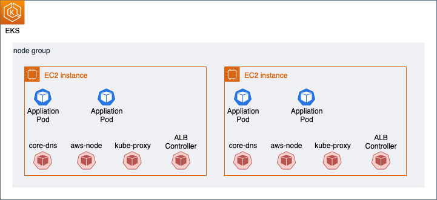

@author: Abhsishek Jawali
# EKS: Migrating to Managed Node Groups with zero downtime

This repository contains the detailed steps for :
- Migrating from unmanaged node groups to managed node groups
- Upgrading managed node groups

## Components of node group


When an EKS cluster is created, it will have the following pods / daemon sets by default, in 'kube-proxy' namespace
- coredns as deployment with 2 replicas
- aws-node as Daemon Set
- kube-proxy as Daemon Set

In addition to the default setup, we will also setup Ingress Controller, which will enable to expose the applications running within EKS through Application Load Balancer. When Ingress Controller is setup, in addition to the above pods, the following pod will be installed in 'kube-proxy' namespace:
- aws-load-balancer-controller


When we deploy applications to EKS cluster, the applications pods will be in addition to the system pods. To migrate the workloads from unmanaged node groups to managed node groups, with 0 downtime, we will:
1. Create Managed node group : When MNG is created, the daemon sets (aws-node and kube-proxy) will be availabe by default. 
2.  Taint all the nodes in existing unmanaged node group with 'NoSchedule'. This will instruct EKS scheduler to not schedule/deploy new pods into these nodes. The existing pods will continue to run and accept traffic. 
3.  Scale the application deployment with increased replicas, so that the application pods will be scheduled/deployed on new managed nodes. Now the application will have its pods running in both unmanaged and managed node groups and will be serving the requests from either of these. Kubernetes service will be load balancing the requests between all the pods. 
4.  We now have to scale the deployments in 'kube-system' so that they are availabe in managed nodes. The 2 deployments of interest in this setup are 'core-dns' and 'aws-load-balancer-controller'. In the initial setup, both these deployments have 2 replicas. Increasing the number of replicas will schedule these in managed nodes. Now, all the components that are required for application to run successfully are available in managed nodes. 
5.  Drain the unmanaged nodes and remove the unmanaged node groups. 
6.  Scale-in the deployments to required capacity

We will see the above steps in action. 

## Pre-requisites
Here are the list of tools/softwares that have to be installed in the user system. 
 - [aws-cli v2](https://docs.aws.amazon.com/cli/latest/userguide/getting-started-install.html) - Command line interface to interact with AWS Services. 
 - [kubectl](https://kubernetes.io/docs/tasks/tools/) - A Kubernetes command line tool, to run commands against Kubernetes clusters. This is used to deploy applications, inspect and manage cluster resources, and view logs.
 - [eksctl](https://docs.aws.amazon.com/eks/latest/userguide/eksctl.html) - Command line tool that is used for creating and managing EKS clusters.
 - [helm](https://helm.sh/docs/intro/install/) - Package manager for Kubernetes
 - [curl](https://curl.se/) - Command line tool for transferring data

 ### Get the code
 ```
 git clone https://github.com/abhishekjawali/eks-migrate-to-managed-node-group.git
 cd eks-migrate-to-managed-node-group
 ```

 ### Set environment variables
For the purpose of this demo, all resources are created in 'us-east-1' region. Set the environment variable 'AWS_REGION' to use the required region. Additionally configure the AWS credentials to a profile and set the environment 'AWS_PROFILE' to use the required profile
```
export AWS_PROFILE=development
export AWS_REGION=us-east-1
```

ekscluster-self-managed-ng and ekscluster-managed-ng already have the region set as 'us-east-1'. 

## Create EKS cluster with unmanaged node groups
Let us create an EKS cluster running with unmanaged node groups. 
```
eksctl create cluster -f ekscluster-self-managed-ng.yaml
```

## Deploy application
Let us deploy a sample application that will expose the API through Application load Balancer using Kubernetes Ingress Controller. To enable ALB on EKS, we have to first setup the Application Load Balancer Controller and associate this with service account. 

### Setup Application Load Balancer Controller
```
eksctl utils associate-iam-oidc-provider \
    --region ${AWS_REGION} \
    --cluster ekscluster-demo \
    --approve

curl -o iam_policy.json https://raw.githubusercontent.com/kubernetes-sigs/aws-load-balancer-controller/v2.3.0/docs/install/iam_policy.json

aws iam create-policy \
    --policy-name AWSLoadBalancerControllerIAMPolicy \
    --policy-document file://iam_policy.json

export ACCOUNT_ID=$(aws sts get-caller-identity --output text --query Account)

eksctl create iamserviceaccount \
  --cluster ekscluster-demo \
  --namespace kube-system \
  --name aws-load-balancer-controller \
  --attach-policy-arn arn:aws:iam::${ACCOUNT_ID}:policy/AWSLoadBalancerControllerIAMPolicy \
  --override-existing-serviceaccounts \
  --approve

helm repo add eks https://aws.github.io/eks-charts

helm upgrade -i aws-load-balancer-controller \
    eks/aws-load-balancer-controller \
    -n kube-system \
    --set clusterName=ekscluster-demo \
    --set serviceAccount.create=false \
    --set serviceAccount.name=aws-load-balancer-controller 
```

### Deploy sample application
```
kubectl apply -f 2048-application.yaml
```

### Verify the deployment and the Ingress resource
```
kubectl get deployment,ingress -n game-2048
```

### Get the Application Load Balancer URL
After deployment is completed, wait for the Application Load Balancer to be active and access the application with the URL. Get the URL that is exported from below command and access this from any web browser: 
```
export APP_URL=$(kubectl get ingress/ingress-2048 -n game-2048 -o jsonpath='{.status.loadBalancer.ingress[0].hostname}')
```

### Deploy the managed node group
```
eksctl create nodegroup -f ekscluster-managed-ng.yaml
```

### Taint unmanaged node groups
```
kubectl taint node -l "alpha.eksctl.io/nodegroup-name"="nodegroup" key=value:NoSchedule
```

### Scale the application
```
kubectl scale deployments/deployment-2048 --replicas=10 -n game-2048
```

### Scale 'kube-system' deployments
```
kubectl scale deployments/aws-load-balancer-controller --replicas=4 -n kube-system

kubectl scale deployments/coredns --replicas=4 -n kube-system 
```

### Drain the unmanaged nodes
```
kubectl drain -l "alpha.eksctl.io/nodegroup-name"="nodegroup" --ignore-daemonsets --delete-emptydir-data
```

### Scale-in the deployments to initial capacity
```
kubectl scale deployments/deployment-2048 --replicas=5 -n game-2048

kubectl scale deployments/aws-load-balancer-controller --replicas=2 -n kube-system

kubectl scale deployments/coredns --replicas=2 -n kube-system 
```

### Delete unmanaged node group
```
eksctl delete nodegroup --approve -f ekscluster-self-managed-ng.yaml
```


## Upgrading the EKS cluster
The EKS cluster that we created is running on v1.20. We will see the steps to upgrate this to v1.21. During the upgrade process, the applications are available and addressing the requests. 

```
eksctl upgrade cluster --name=ekscluster-demo --approve
```

## Upgrade the managed node group
```
eksctl upgrade nodegroup --name=nodegroup-mng --cluster=ekscluster-demo --kubernetes-version=1.21
```

## Cleanup
```
kubectl delete -f 2048-application.yaml

eksctl delete iamserviceaccount \
  --cluster ekscluster-demo \
  --namespace kube-system \
  --name aws-load-balancer-controller 

aws iam delete-policy \
    --policy-arn arn:aws:iam::${ACCOUNT_ID}:policy/AWSLoadBalancerControllerIAMPolicy

eksctl delete cluster -f ekscluster-managed-ng.yaml
```